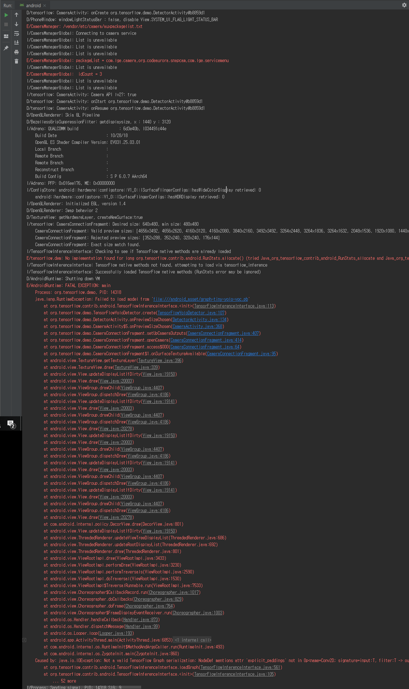
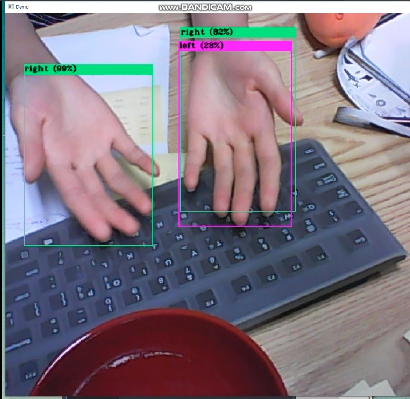
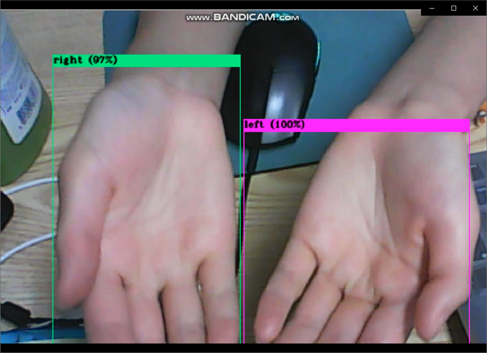
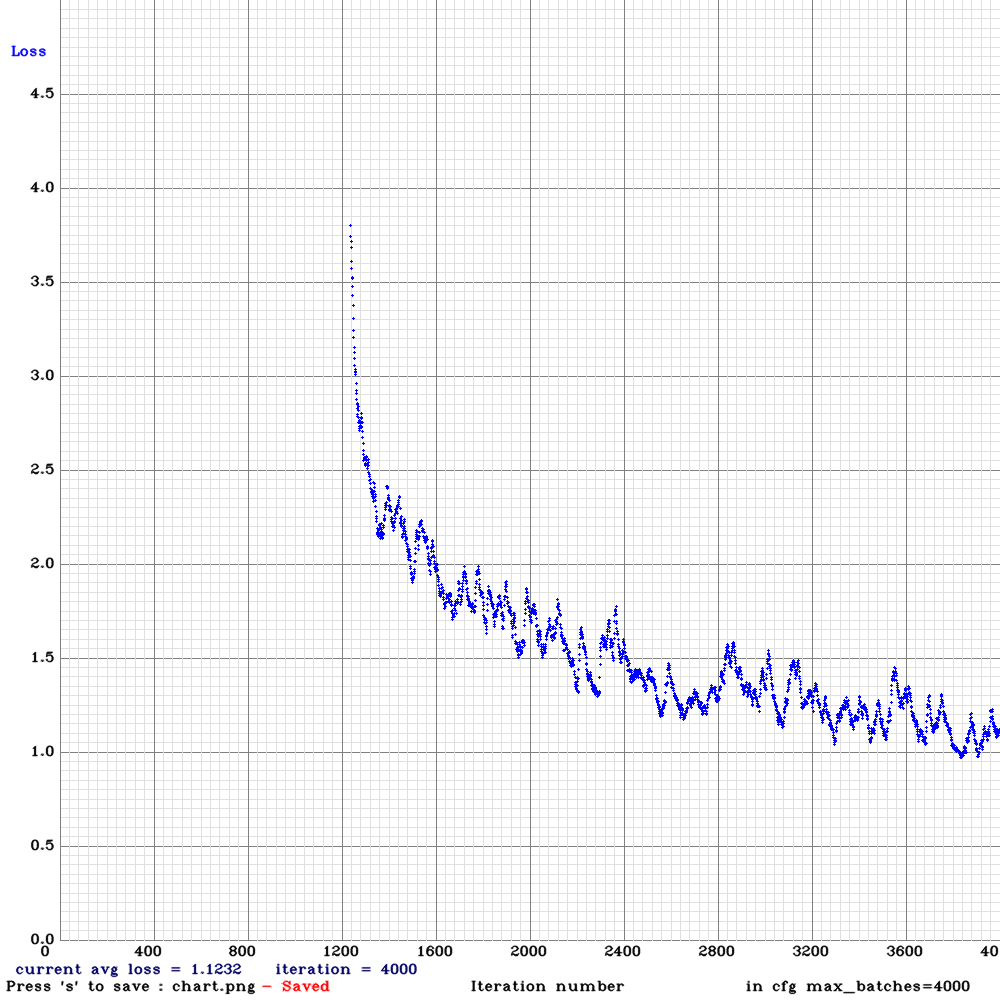
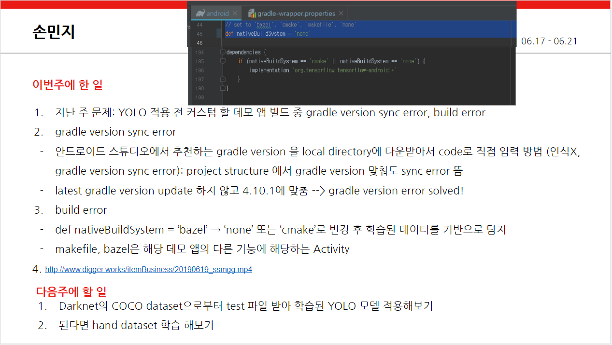

# 진행상황(최신 순)


---
### 20190728
#### tiny-yolo-voc.cfg 를 class 두개로 수정해 학습

1. tiny-yolo-voc.cfg 를 class 두개로 수정해 학습 중(left, right)
```
# computer1
lr: 1e-3
batch: 8
epoch: 50(goal)

#computer2
lr: 1e-2
batch: 16
epoch: 100(goal)
```

2. 해당 configure에 대해 앱 빌드 성공(학습 후에 다시 빌드 예정 - loss가 아직 높아 정확한 detection 불가능)


---
### 20190726
#### 안드로이드 오류 해결, but detection 정확도 매우 낮음, tensorflow 버전 맞춰서 재학습

1. 안드로이드 오류 해결
    - 원인: 지난 주 사용했던 tensorflow==1.14.0에 포함된 패키지인 protobuf==3.9를 사용해 .pb파일 변환 시
    ```cmd
    python flow --model cfg/yolo-mj.cfg --load -1 --loadpb --verbalise
    ```
    .pb 파일을 안드로이드 스튜디오에서 열었을 때 'explicit_paddings'이라는 요구 조건과 다른 구성이 들어있었음
    이에 따라 어플 실행 시 해당 파일을 로드하지 못하는 오류가 생겼음 _(20190725 참고)_
    
    - 해결 방법: tensorflow==1.13.1 사용
      (protobuf==3.8 사용 - protobuf google 홈페이지 참고 https://developers.google.com/protocol-buffers/)


2. detection 확률 매우 낮음
  : (추정 원인 1) class 수가 20개인 'tiny-yolo-voc.cfg'를 변환없이 사용함으로써, 정답(데이터셋)은 'left', 'right'만 지정해 다른 class에 대해서는 학습이 이뤄지지 않음 _가능성 제일 높음_
    (추정 원인 2) 해당 weight가 앱에 제대로 로드되지않았거나, 학습이 제대로 이뤄지지않음


3. 학습 시작 12시간 경과
```
lr: 1e-04
batch: 32
```
  : loss 4 (step12000)
  


4. lr 수정
```
lr: 5e-06 
```


---
### 20190725
#### darkflow 학습시 텐서플로 버전 낮추면 에러, 어플 빌드 성공 but 실행 X



```android studio
Caused by: java.io.IOException: Not a valid TensorFlow Graph serialization: NodeDef mentions attr 'explicit_paddings' not in Op<name=Conv2D; signature=input:T, filter:T -> output:T; attr=T:type,allowed=[DT_HALF, DT_BFLOAT16, DT_FLOAT, DT_DOUBLE]; attr=strides:list(int); attr=use_cudnn_on_gpu:bool,default=true; attr=padding:string,allowed=["SAME", "VALID"]; attr=data_format:string,default="NHWC",allowed=["NHWC", "NCHW"]; attr=dilations:list(int),default=[1, 1, 1, 1]>; NodeDef: {{node 0-convolutional}}. (Check whether your GraphDef-interpreting binary is up to date with your GraphDef-generating binary.).
```
- 실패 이유?
- 내 .pb 파일에는 explicit_paddings 이 있다.. 다른 건 없음 --> 읽는 함수에 문제? or pb 변환과정에 문제(tensorflow 버전)


---
### 20190722
#### 어플 실행 안됨, darkflow로 재학습


1. darkflow로 재학습

  [txt -> xml 변환 코드 ](https://murra.tistory.com/62?category=693207)
  학습 과정은 [darkflow github](https://github.com/thtrieu/darkflow)와 [메인 페이지 블로그](https://junyoung-jamong.github.io/deep/learning/2019/01/22/Darkflow%EB%A5%BC-%ED%99%9C%EC%9A%A9%ED%95%B4-YOLO%EB%AA%A8%EB%8D%B8-%EC%9D%B4%EB%AF%B8%EC%A7%80-%EB%94%94%ED%85%8D%EC%85%98-%EA%B5%AC%ED%98%84-in-windows.html) 참고


---
### 20190719
#### 10000번까지 학습 완료, 안드로이드 얹는 작업 실패, Yolo v2 로 학습 재시작


1. 안드로이드 얹는 작업 - 실패

   (추정 원인) 구글링 결과, 해당 tensorflow android example은 yolo v3 지원하지 않음

2. Yolo v2로 학습 시작


---
#### 20190718
##### learning rate 변경, 학습

1. cfg 변경

```
18: learning_rate=0.001
```


2. 7000번까지 학습

- left detection이 잘 안됨




- memory error
```
#yolo-mj.cfg
width=416(<-608)
height=416(-<608)
```


3. 8000번까지 학습

- left detection 잘됨




---
#### 20190716
##### cfg 변경, 4000번 학습(detection X)
1. cfg 변경

  yolo3-mj.cfg


2. 4000번까지 학습


- detection: 실패

  (원인)학습량 부족(thresh=0 설정 -> detection 됨 -> 결론: 학습에서 문제 발생)





----
#### 20190712
##### annotation 작업 마침

hand.name, hand.data, mj-yolov3-tiny.cfg

[annForm2.py](./AA/annForm2.py)

---
#### 20190619


